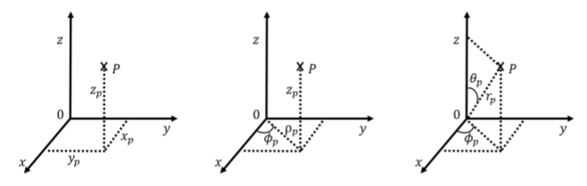

---
author:
- 'St John Baptist De La Salle Catholic School, Addis Ababa'
date: 'October, 2023'
title: Grade 11 Physics Workbook
---

1. Physics & Human Society {#physics-human-society .unnumbered}
==========================

Chapter Summary {#chapter-summary .unnumbered}
---------------

**Physics, a Beautiful Science**

-   Physics is a natural science that involves the study of matter and
    its motion through space and time, along with related concepts such
    as energy and force. It is the study of the universe itself; how it
    began, how it operates, and how it will be done.

-   Many scientific disciplines, such as biophysics, physical chemistry
    and engineering, are hybrids of physics and other sciences.

-   The application of physics is fundamental towards significant
    contributions in new technologies that arise from theoretical
    breakthroughs that we use daily. All electronics, cryptographic
    encryptions, medical instruments, the internet itself, and more have
    been the direct result of physics.

    **Models, Theories & Laws**

-   A model is an evidence-based representation of something that is
    either too difficult or impossible to display directly.

-   A theory is an explanation for patterns in nature that is supported
    by scientific evidence and verified multiple times by various groups
    of researchers.

-   A law uses concise language, often expressed as a mathematical
    equation, to describe a generalized pattern in nature that is
    supported by scientific evidence and repeated experiments.

-   A background in physics is probably one of the most versatile career
    paths. You can use your skills to work in multiple disciplines
    including but not limited to astronomy, healthcare, engineering,
    energy, technology, meteorology, finance, and the like..

-   Recent developments in physics include discovery and imaging of
    black holes, quantum cryptography, quantum computing, AI & ML,
    Gravitational Waves, Understanding of the Universe through many
    missions like the recent JWST, Neutrino Astronomy, and many more
    exciting stuff.

**The Scientific Method**

The scientific method provides scientists with a well structured
scientific platform to help find the answers to their questions.

Questions {#questions .unnumbered}
---------

How is a model different from a theory?(For instance, you have learned
phrases like \"the Dalton Atomic Model\" and \"Kinetic Theory of
Gases\".. why is one a model and the other a theory?) What is the
difference between algorithms that are *computationally secure* and
those that are *information theoretically secure*? What are common ways
people's passwords and personal information get compromised? How can one
protect themselves from such attacks? We have discussed in class the
discrepancy between the same observation but different analyses of a
data set. We took the news regarding observations by JWST data being
interpreted differently by different groups of scientists. A prominent
bloc suggest that the electromagnetically undetectable, but seemingly
gravitationally present \"matter\" is dark matter while dissidents
suggest that Newton's Universal Gravitation Law applies differently for
distant large galaxies. Which idea do you seem to agree more with? Why?
Research is extremely important for many different reasons; we recently
saw its significance during the COVID-19 pandemic when many otherwise
expensive journals were pressured into making the pandemic related
researches published and accessible for free. The free movement of
research led to many people believing in the methodology of the vaccine
production and even more others chipping in ideas to better the research
being done. Now that the pandemic is over, many of those articles are
back on paywall and one has to pay large sums to access the research
articles. Explain whether you agree on the current model of article
publications or whether you think research articles should be open
access always. Give examples of open access journals and/or research
repositories. In collaborations like the CERN (European Organization for
Nuclear Research), there are multiple people from different backgrounds,
institutions, and even countries collaborating to do research. CERN is
the home of many experiments such as ALICE(A Large Ion Collider
Experiment), LHC(the Large Hadron Collider), CMS(Compact Muon Solenoid)
which have been significant in many high energy physics experiments such
as the one done to discover the famous Higgs Boson.

-   What (simply )is the significance of the Higgs Boson?

-   Why is such a big collaboration important in your opinion? Why
    wasn't, say the Higgs Boson discovered in a small lab of 4 people in
    a rural town?\

-   CMS(Compact Muon Solenoid) is a general purpose particle
    accelerator. Say, for example, a theorist proposed existence of a
    particle that you would like to detect. Based on electromagnetism
    concepts we discussed last semester, how would you design an
    experiment to detect said particle?

Physics communities are important to nourish underrepresented members of
the community and also generally to advocate for physics within the
general community. Out of the communities we have seen in class, which
ones do you feel most interested by? Why? Your hobbies are probably
directly or indirectly related to physics. List some of your hobbies and
explain how physics plays a role. What is the difference between
experiential and non-experiential knowledge? It is true that in
science(as in any other field), rivalries do exist. It wouldn't be an
exaggeration to, perhaps, suggest that scientific rivalries may even be
on the fiercer side of the rivalry spectrum, so to speak. Some of these
rivalries include ones between *Nikola Tesla* and *Thomas Edison*,
*Isaac Newton* and *Gottfried Leibniz*, *Isaac Newton* and *Robert
Hooke* and ones between countries. It would be wrong to suggest that
rivalries serve no purpose, however, in the pursuit of scientific truth,
working with adversaries can pay off. A research dubbed *Adversarial
Collaboration Project* which ran at UPenn hypothesized that for
advancement of scientific facts, rivals would have to work together.
What is your take on this? How different do you think the world could
have been if adversarial collaborations were a common practice since the
early days of science?

2. Vectors {#vectors .unnumbered}
==========

Chapter Summary {#chapter-summary-1 .unnumbered}
---------------

**Scalars and Vectors**

-   A vector quantity is any quantity that has magnitude and direction,
    such as displacement or velocity.

-   Geometrically, vectors are represented by arrows, with the end
    marked by an arrowhead. The length of the vector is its magnitude,
    which is a positive scalar. On a plane, the direction of a vector is
    given by the angle the vector makes with a reference direction,
    often an angle with the horizontal(usually +X-axis). The direction
    angle of a vector is a scalar.

-   Two or more vectors can be added to form another vector. The vector
    sum is called the resultant vector. We can add vectors to vectors or
    scalars to scalars, but we cannot add scalars to vectors. Vector
    addition is commutative and associative.

-   To construct a resultant vector of two vectors in a plane
    geometrically, we use the parallelogram rule. To construct a
    resultant vector of many vectors in a plane geometrically, we use
    the tail-to-head method.

**Coordinate Systems and Components of a Vector**

-   Vectors are described in terms of their components in a coordinate
    system. In two dimensions (in a plane), vectors have two components.
    In three dimensions (in space), vectors have three components.

-   A vector component of a vector is its part in an axis direction. The
    vector component is the product of the unit vector of an axis with
    its scalar component along this axis. A vector is the resultant of
    its vector components.

-   In a plane, there are two equivalent coordinate systems. The
    Cartesian coordinate system is defined by unit vectors $\hat{i}$ and
    $\hat{j}$ along the x-axis and the y-axis, respectively. The polar
    coordinate system is defined by the radial unit vector $\hat{r}$,
    which gives the direction from the origin, and a unit vector
    $\hat{t}$, which is perpendicular (orthogonal) to the radial
    direction.

**Vector Operations : Addition/Subtraction**

-   We can graphically add/subtract vectors using triangle and
    parallelogram methods. To do that, however, we have to draw the
    vectors scaled.

-   When using parallelogram method, we can sort of make it hybrid by
    introducing mathematical tools such as the law of cosines
    $b^2 ~=~ a^2 ~+~ c^2 ~-~ 2ca\;\cos\theta$ such that $\theta$ is the
    angle between $a\text{ and }c$.

-   Analytical methods of vector algebra are used routinely in
    mechanics, electricity, and magnetism. They are important
    mathematical tools of physics.

**Vector Operations : Product**

-   There are two kinds of multiplication for vectors. One kind of
    multiplication is the scalar product, also known as the dot product.
    The other kind of multiplication is the vector product, also known
    as the cross product. The scalar product of vectors is a number
    (scalar). The vector product of vectors is a vector.

-   Both kinds of multiplication have the distributive property, but
    only the scalar product has the commutative property. The vector
    product has the anticommutative property, which means that when we
    change the order in which two vectors are multiplied, the result
    acquires a minus sign.

**Useful Mathematical Facts**

-   Polar coordinates in a two dimensions
    $\begin{cases} x = r \cos \varphi \\ y = r \sin \varphi \end{cases}$

    

-   Cylindrical coordinate system
    $\begin{cases} \rho &= \sqrt{x^2+y^2}\\ \tan(\phi) &= \frac{y}{x}\\ z&=z\end{cases}$

-   Spherical coordinate system
    $\begin{cases} r &= \sqrt{x^2+y^2+z^2}\\ \cos(\theta) &= \frac{z}{r}=\frac{z}{\sqrt{x^2+y^2+z^2}}\\ \tan(\phi) &= \frac{y}{x}\\\end{cases}$

-   Equal vectors & condition for equivalence
    $\vec{A} = \vec{B} \Leftrightarrow \begin{cases} A_{x} = B_{x} \\ A_{y} = B_{y} \\ A_{z} = B_{z} \end{cases}$

-   A unit vector $\hat{V} = \dfrac{\vec{V}}{V}$

-   Dot product of unit vectors
    $\hat{i} \cdotp \hat{j} = \hat{j} \cdotp \hat{k} = \hat{k} \cdotp \hat{i} = 0$

-   Cross product of unit vectors
    $\begin{cases} \hat{i} \times \hat{j} = + \hat{k}, \\ \hat{j} \times \hat{l} = + \hat{i}, \\  \hat{l} \times \hat{i} = + \hat{j} \ldotp \end{cases}$

Questions {#questions-1 .unnumbered}
---------

Basics of vector understanding.

-   A vector has zero magnitude. Is it necessary to specify its
    direction? Explain. Can a magnitude of a vector be negative? If
    three vectors sum up to zero, what geometric condition do they
    satisfy? Show all the steps.

For the figure given below, use triangle or parallelogram methods of
vector addition to find the resultant. Use law of cosines to find the
length of the resultant.

-   $3\vec{A} - 2 \vec{F}$

-   $\vec{A} -  \vec{C} + \vec{B}$

-   $\vec{A} -  \vec{D} + \vec{F}-4\vec{F}$

The magnitudes of two displacement vectors are $|\vec{A}|$ = 12 cm and
$|\vec{B}|$ = 5 cm. What are the largest and the smallest values of the
magnitude of the resultant $\vec{R}=\vec{A}+\vec{B}$? The polar
coordinates of a point are $(-\dfrac{4}{3}\pi,4)$. What are its
Cartesian coordinates?\
\

-   What is the displacement vector from point (1,2,3) to point (7,8,9)?

-   What angle does that displacement vector make with the $x$ axis?

A force vector points at an angle of 53$^0$ above the +x axis. It has a
y component of 340 newtons. Find

-   the magnitude

-   the x component

Vector **A** has a magnitude of 9.00 units and points due West. Vector
**B** points due north.

-   What is the magnitude of B, if the vector A+B points 45.0$^0$ north
    of east?

-   Find the magnitude of A + B.

For an object moving in uniform circular motion, the direction of the
instantaneous acceleration vector is\

equal to zero directed radially outward\
directed radially inward tangent to the path of motion

Which of the following sets of 3 forces CANNOT have a vector sum of
zero? **Why?**\

10, 10 and 10 Newtons 10, 10 and 20 Newtons\
10, 20 and 20 Newtons 10, 20 and 40 Newtons

What is the magnitude (length) of the vector
$2\hat{i}+9\hat{j}-4\hat{k}$? What is the unit vector in the direction
of the above vector? After you find the unit vector, show that it is a
unit vector by calculating its magnitude. Convert the following equation
using Cartesian coordinates to cylindrical ones.

-   ${x^4} + \dfrac{2}{7}{x^3} - 6z = 4 - 2{y^2}$

The standard equation of an ellipse in the Cartesian plane is
$\dfrac{x^2}{a^2}+\dfrac{y^2}{b^2}=1$. Show that its equation in the
polar coordinate system is given by $r = \dfrac{1}{1+e \cos \theta}$.

Let's assume we have three vectors such that
$\vec{A}=3\hat{i}-7\hat{j}$, $\vec{B}=\hat{i}+\hat{j}+4\hat{k}$,
and$\vec{C}=5\hat{j}-8\hat{k}$. Find the following

-   $|\vec{A}|$ and $\hat{A}$

-   the component of $\vec{C}$ along $\vec{A}$

-   $\vec{A}\times\vec{C}$

-   $\vec{A}\times(\vec{C}\cdot\vec{B})$

-   $\vec{A}\times(\vec{C}\times\vec{B})$

-   $\hat{i}\cdot(\vec{C}\times\vec{B})$

Convert the following equation in Cartesian coordinates to spherical
ones.

-   $3{x^2} + {y^2} = 8x + 2z - 4$

Find a unit vector parallel to either direction of the line described by
4x+y = 8.

-   Vector $\vec{B}$ is 7.0 cm long and vector $\vec{A}$ is 4.0 cm long.
    Find the angle between these two vectors when
    $|\vec{A}+\vec{B}|$=$|\vec{A}-\vec{B}|$

-   Draw the vectors and join their tails after you have found the angle
    between them. What special kind of parallelogram have you
    constructed using the two vectors and their extensions?

Calculate the vector product of $\vec{a}$ and $\vec{b}$ given that
$\vec{a}$= 2$\hat{i}$ + $\hat{j}$ + $\hat{k}$ and $\vec{b}$ = $\hat{i}$
-- $\hat{j}$ -- $\hat{k}$ . Show that the area of a parallelogram formed
by two vectors is equal to their cross product. What is the angle
between vectors $\vec A = \left\langle {1,2,3,4} \right\rangle$ and
$\vec B = \left\langle {0, - 1,4, - 2} \right\rangle$? For the two
vectors above, find
${{\mathop{\rm proj}\nolimits} _{\,\vec A}}\,\vec B$.
